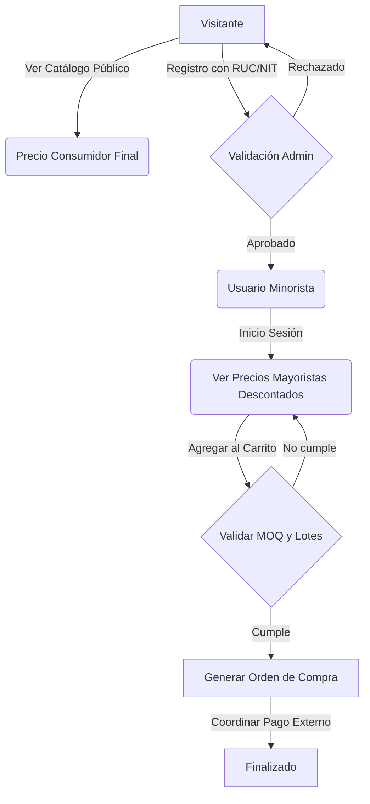
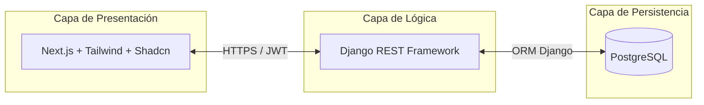

# Idea General del Aplicativo Web: "Bazar B2B + D2C"

## 1. Concepto Central

**Bazar B2B + D2C** es una plataforma digital e intermediario transaccional que opera bajo un modelo híbrido **B2B (Business-to-Business) + D2C (Direct-to-Consumer) por volumen** (similar a un club de precios digital). Conecta directamente a la cadena de suministro (fabricantes, proveedores y mayoristas) con dos segmentos de compradores: minoristas (tiendas y supermercados) y consumidores finales que requieren mercancía a gran escala (por ejemplo, para eventos).

---

## 2. Mecánica de Operación

A diferencia de un e-commerce tradicional, el sistema impone reglas mayoristas estrictas. Todas las transacciones están regidas por:
- **Cantidades Mínimas de Pedido (MOQ)**.
- Configuración de ventas por **lotes cerrados** (por ejemplo, cajas de 12 o 24 unidades).

---

## 3. Visibilidad y Precios Dinámicos (Role-Based Pricing)

La plataforma cuenta con un catálogo de acceso público que permite el posicionamiento en buscadores (SEO) y sirve como gancho de ventas.

* **Usuarios Generales (No registrados):** Ven el catálogo con el precio base por volumen orientado al consumidor final.
* **Minoristas (Verificados):** Tras un proceso de registro y validación de su identificación fiscal por parte de la administración, estos usuarios inician sesión para desbloquear descuentos especiales y precios escalonados según su perfil empresarial.

---

## 4. Estructura de Interfaces

El ecosistema se sostiene sobre tres portales independientes:

* **Portal Mayorista:** Donde los proveedores publican su catálogo, configuran lotes y gestionan los pedidos entrantes.
* **Portal Cliente (Unificado):** Una única interfaz de compra donde tanto negocios como consumidores por volumen descubren productos, realizan pedidos y rastrean su logística.
* **Backoffice (Superadministrador):** Panel interno para los operadores de "Bazar B2B", destinado a validar cuentas comerciales, moderar la plataforma y gestionar el modelo de negocio.

---

## 5. Modelo de Sostenibilidad

El aplicativo web garantizará su rentabilidad y mantenibilidad mediante un modelo de monetización basado en **planes de suscripción** cobrados a los mayoristas por el derecho a usar la plataforma y acceder a la red de compradores.

---

# Tipos de Monetización

## Planes de Suscripción (Auspiciante)

Ofrecer a los proveedores o mayoristas diferentes niveles de membresía y un apartado freemium, con distintos beneficios como más productos listados dentro de la página, mayor visibilidad o acceso a herramientas analíticas.

> [!NOTE]
> Para el MVP, se limitará el alcance implementando únicamente el **Plan Básico** y la versión **Freemium** para validar la recepción de la plataforma.

### 1. Plan Básico
*Ideal para pequeños fabricantes o distribuidores locales (Plan prioritario para el MVP).*
Este plan funciona como la puerta de entrada. Está diseñado para que los proveedores que tienen dudas sobre digitalizarse puedan probar "Bazar B2B" con una barrera de entrada baja.

* **Límite de Productos:** Hasta 100 o 150 productos publicados (SKUs).
* **Características Incluidas:**
  * Acceso al portal de mayorista para recibir y gestionar pedidos.
  * Configuración de reglas de compra (MOQ y Lotes).
  * Aparición en los resultados de búsqueda estándar.
  * Soporte técnico por correo electrónico.
* **Precio Sugerido:** Un valor mensual accesible (ej. $29 - $49 USD/mes) que cualquier negocio puede cubrir.
* **Versión Freemium:** Sin configuración de reglas de compra y limitado a un máximo de 50 productos publicados.

### 2. Plan Pro o "Mayorista"
*El plan central y más vendido (A futuro).*
Este debe ser el plan donde se proyecta que caiga el 70% de los clientes. Está pensado para distribuidores formales de consumo masivo que manejan catálogos amplios y necesitan más herramientas.

* **Límite de Productos:** Hasta 500 o 1,000 productos publicados.
* **Características Incluidas:**
  * *Todo lo del Plan Básico, más:*
  * **Carga Masiva de Catálogo:** Herramienta para subir o actualizar productos e inventario rápidamente mediante plantillas de Excel/CSV (vital para catálogos grandes).
  * **Reportes de Ventas Básicos:** Panel de estadísticas para ver qué productos se venden más.
  * **Visibilidad Mejorada:** Posibilidad de elegir 5 productos al mes para que aparezcan en una sección de "Destacados" o "Recomendados".
* **Precio Sugerido:** Un valor intermedio (ej. $89 - $129 USD/mes).

### 3. Plan Premium o "Corporativo"
*Para grandes marcas y distribuidores nacionales (A futuro).*
Este plan está dirigido a las "ballenas", las grandes empresas que quieren dominar la plataforma y no tener límites.

* **Límite de Productos:** Ilimitado (Catálogo completo).
* **Características Incluidas:**
  * *Todo lo del Plan Pro, más:*
  * **Máxima Exposición:** Banners publicitarios en la página principal (Home) de "Bazar B2B" garantizando máxima visibilidad ante todas las tiendas y consumidores finales.
  * **Analítica Avanzada:** Reportes detallados sobre tendencias del mercado (ej. qué buscan las tiendas en su región, carritos abandonados).
  * **Integración API (Opcional a futuro):** Capacidad de conectar "Bazar B2B" directamente con su sistema contable o ERP interno (como SAP).
  * **Ejecutivo de Cuenta Dedicado:** Soporte prioritario vía WhatsApp o teléfono.
* **Precio Sugerido:** Un valor alto (ej. $250 - $400+ USD/mes).

---

# Análisis de Negocio

## 1. Objetivo General (La Meta Principal)

Digitalizar y centralizar el canal de ventas al por mayor mediante una plataforma web transaccional, conectando eficientemente a proveedores con minoristas y compradores por volumen, garantizando la rentabilidad de las operaciones a través de controles estrictos de inventario y pedidos.

## 2. Objetivos Específicos (Operativos y Financieros)

* **Automatización de la Preventa (Reducción de Costos):** Disminuir los costos operativos y de nómina de los proveedores al reducir la dependencia de vendedores de ruta (preventistas), permitiendo que el aplicativo actúe como un canal de toma de pedidos automatizado que funciona 24/7.
* **Protección del Margen de Proveedores (Garantía de Rentabilidad):** Prevenir las pérdidas asociadas a la venta por unidad exigiendo técnicamente el cumplimiento de Cantidades Mínimas de Pedido (MOQ) y venta por lotes, asegurando que la logística de cada orden sea financieramente viable para el mayorista.
* **Expansión de Alcance Comercial (Valor Añadido):** Permitir a los mayoristas llegar a nuevos clientes minoristas y consumidores de eventos a los que su fuerza de ventas tradicional no logra llegar físicamente, expandiendo su cuota de mercado.
* **Sostenibilidad del Aplicativo (Rentabilidad Propia):** Garantizar el mantenimiento y crecimiento técnico de "Bazar B2B" mediante la captación de ingresos recurrentes a través de un modelo de suscripciones para los mayoristas.

---

# Páginas de Referencia

* **[Mayoristas.ec](https://mayoristas.ec/)**
  * Página web para buscar mayoristas; sin embargo, carece de una interfaz interactiva y transaccional adecuada.
* **[Tienda El Merkato](https://tienda.elmerkato.com/)**
  * El primer Cash & Carry del Ecuador, con distintas sucursales para la venta al minorista. Tiene una tienda digital donde publica sus productos para vender en pacas o unidades a precios rebajados. Es la definición directa de un competidor mayorista con canal digital.

---

# Cadena de Valor del Negocio

## 1. Agregación de Oferta
*Se convertirá en el "Módulo de Proveedores y Catálogo".*
Este es el punto de partida. Si no hay productos con reglas claras, el negocio no funciona. Aquí el mayorista alimenta el sistema.

* **Visión de Negocio:** Permitir a los proveedores subir su inventario de la forma más sencilla posible, estableciendo las reglas de juego para no perder dinero.
* **Futuras funcionalidades clave (MVP):**
  * Creación de productos (foto, título, descripción).
  * Configuración del motor de reglas: Definición de Cantidad Mínima de Pedido (MOQ) y tamaño del Lote (múltiplos de venta).
  * Asignación de precio base y precio de minorista.

## 2. Exhibición y Descubrimiento
*Se convertirá en el "Módulo de Escaparate / Frontend Público".*
Una vez que la oferta está en el sistema, debe ser visible para atraer ventas de ambos públicos (eventos/consumidor final y tiendas).

* **Visión de Negocio:** Actuar como un catálogo digital 24/7 que capte clientes orgánicamente y muestre los precios correctos según quién esté mirando.
* **Futuras funcionalidades clave (MVP):**
  * Catálogo público navegable (Búsqueda y categorías).
  * Motor de precios dinámico: Mostrar precio de consumidor final a visitantes, y revelar precio de descuento a tiendas que hayan iniciado sesión.
  * Formulario de registro con captura de datos comerciales (RUC/NIT) para nuevos minoristas.

## 3. Transacción y Control
*Se convertirá en el "Módulo de Carrito B2B y Pedidos".*
El momento crítico. Aquí el cliente (tienda o consumidor) selecciona lo que quiere y el sistema verifica que la compra sea rentable para el mayorista.

* **Visión de Negocio:** Cerrar la intención de compra aplicando restricciones estrictas de volumen antes de generar la orden formal.
* **Futuras funcionalidades clave (MVP):**
  * Carrito de compras inteligente (Validador que bloquea el checkout si no se cumple el MOQ o el múltiplo del lote).
  * Generación de la "Orden de Compra" (sin pasarela de pago bancaria para el MVP, el pago se acuerda de forma externa).
  * Historial de pedidos para el cliente.

## 4. Gestión Operativa y Cumplimiento
*Se convertirá en el "Módulo Backoffice y Despacho".*
La orden ya fue realizada, ahora los administradores y los mayoristas deben gestionarla para asegurar que el producto llegue y el cliente vuelva a comprar.

* **Visión de Negocio:** Brindar a los operadores del sistema y a los mayoristas el control total sobre los usuarios y los pedidos entrantes para cumplir con la entrega.
* **Futuras funcionalidades clave (MVP):**
  * **Panel del Mayorista:** Bandeja de entrada para ver pedidos nuevos, aceptar/rechazar orden y cambiar estados (Pendiente, En preparación, Entregado).
  * **Panel del Súper Administrador:** Bandeja de validación para aprobar o rechazar manualmente a los usuarios que solicitan el rol de "Minorista" (validación de documentos).

---

# Flujo de Usuario

## 1. El Mayorista (Configuración y Gestión de Catálogo)
Este flujo se enfoca en la configuración inicial que debe realizar el proveedor antes de recibir pedidos, estableciendo las reglas comerciales que garantizarán su rentabilidad.

* **Perfil y Documentación:**
  * **Inicio:** Registro básico y creación de perfil comercial.
  * **Validación:** Subir RUC/NIT y documentos legales. Esperar aprobación del administrador para activar el rol de mayorista.
  * **Configuración Inicial:** Configuración de la empresa (dirección, contacto).
* **Gestión de Oferta:**
  * **Carga de Producto:** Registrar productos con foto, descripción, precio base y cantidad mínima de compra.
  * **Motor de Reglas (Reglas de Compra):** Definir el MOQ (Cantidad Mínima) y el Lote (unidad de venta) para cada producto.
  * **Precios:** Asignar precio de venta al consumidor final y, opcionalmente, un precio especial de minorista.
* **Gestión de Pedidos (Recepción):**
  * **Notificación:** Recibir alerta cuando un minorista o consumidor genera una orden.
  * **Procesamiento:** Acceder al panel de pedidos para ver el detalle, verificar que se cumplen las reglas de compra y cambiar estados (Preparando, Enviado).

## 2. El Minorista (Ahorro de Tiempo y Gestión de Inventario)
Este flujo se centra en cómo la tienda ahorra tiempo y puede comprar mayores volúmenes de forma eficiente.

* **Perfil y Documentación:**
  * **Inicio:** Registro básico.
  * **Validación (Pasarela de Aprobación):** Solicitar el rol de minorista. Debe presentar RUC/NIT y/o documento de identificación, ya que el administrador debe aprobar manualmente la cuenta antes de darle acceso a los precios de descuento.
* **Compras Estratégicas:**
  * **Exploración:** Buscar productos y categorías disponibles.
  * **Compra por Lote:** Verificar que el precio y las cantidades del carrito cumplan con el lote establecido por el mayorista (ej. si el lote es 20, solo se puede pedir 20, 40, 60 unidades).
  * **Cierre de Pedido:** Finalizar la orden y generar el número de pedido.
* **Seguimiento:**
  * **Monitoreo:** Consultar el historial de pedidos y verificar el estado de la entrega.

## 3. Consumidor Final (Eventos y Compras por Volumen)
Este flujo está diseñado para capturar ventas de impulso en eventos, donde el usuario busca una buena oferta en grandes cantidades, pero no es una tienda registrada.

* **Exploración Pública:**
  * **Catálogo Abierto:** Navegar por todos los productos publicados por los mayoristas sin necesidad de iniciar sesión.
  * **Visibilidad de Precios:** Ver el precio regular de venta al público (no ve precios de minorista verificado).
* **Ofertas y Eventos:**
  * **Sección de Ofertas:** Acceder a productos marcados con descuentos especiales o grandes lotes (ej. "Paca de 20 unidades").
* **Transacción:**
  * **Carrito:** Seleccionar productos y cantidades.
  * **Cierre de Pedido:** Generar una orden de compra al mayorista para que puedan establecer el cobro y coordinar la entrega o recogida del pedido de manera directa.

## 4. El Administrador (Control y Moderación)
Este flujo es el del operador que mantiene la plataforma funcionando, asegurando la calidad y seguridad de los datos.

* **Supervisión de Usuarios:**
  * **Validación de Nuevos Usuarios:** Revisar los documentos (RUC/NIT) de los usuarios que solicitan ser minoristas para aprobar o rechazar su registro.
  * **Moderación:** Bloquear o eliminar usuarios si incumplen las normas.
* **Gestión de Contenido:**
  * **Publicidad:** Habilitar o deshabilitar espacios publicitarios para los proveedores premium.
  * **Destacados:** Seleccionar manualmente qué productos aparecerán en la página principal (Home).
  * **Publicación de Contenido:** Aprobar nuevos mayoristas y sus catálogos iniciales.

---

# Stakeholders

* **El Auspiciante / Inversor (Stakeholder Principal):** Su interés es ver un producto funcional en agosto que demuestre que el modelo de negocio es viable y puede rentabilizarse (reduciendo costos de preventistas).
* **Los Proveedores / Mayoristas:** Buscan una plataforma extremadamente fácil de usar para subir productos sin perder tiempo y que resguarde sus márgenes mediante controles estrictos de volumen.
* **Los Minoristas (Tiendas/Supermercados):** Buscan mejores precios, un catálogo transparente y la conveniencia de hacer pedidos 24/7 sin depender de la visita física del camión repartidor.
* **Consumidores Finales (Eventos):** Buscan acceso a precios de distribuidor comprando en volumen de forma sencilla.
* **El Equipo de Desarrollo:** Su interés es tener requerimientos claros, un alcance cerrado que evite el *scope creep*, y un stack que agilice la entrega.

---

# Alcance Estricto para el MVP (Agosto)

> [!IMPORTANT]
> Para cumplir con los plazos de entrega, el flujo de desarrollo se mantendrá lineal y enfocado únicamente en las características clave.

* **Catálogo Público y Precios por Rol:** Visualización de productos. Visitantes ven precio de consumidor final; minoristas verificados acceden a precios especiales.
* **Motor de Reglas de Compra:** El carrito valida y bloquea el checkout si no se cumple el MOQ o si no se respetan las unidades de lote.
* **Gestión de Pedidos Simplificada:** El MVP genera una "Orden de Compra" en formato digital. El pago se gestiona fuera de la plataforma (transferencia directa o contra entrega).
* **Paneles Básicos:**
  * *Mayorista:* Subida manual e individual de productos (imagen, precio, MOQ, lote) y gestión de pedidos recibidos.
  * *Cliente:* Historial y estado de pedidos realizados.
  * *Administrador:* Aprobación o rechazo manual de solicitudes de rol "Minorista".

---

# Stack Tecnológico

| Capa del Sistema | Tecnología Recomendada | Justificación Estratégica |
| :--- | :--- | :--- |
| **Frontend (Interfaz)** | Next.js (React) | Renderizado del lado del servidor (SSR) para indexación SEO y óptimo posicionamiento orgánico. |
| **Estilos (Diseño UI)** | Tailwind CSS + Shadcn UI | Desarrollo ágil de las tres interfaces mediante componentes listos y customizables. |
| **Backend & Base de Datos** | Django (PostgreSQL) | Framework robusto con ORM integrado y un panel de administración nativo que acelera el desarrollo. |
| **Infraestructura** | Vercel / Docker | Despliegue continuo, fácil portabilidad y entornos consistentes. |

---

# Arquitectura

### 1. Arquitectura Base del Sistema (Modelo de 3 Capas)
Implementaremos una **Arquitectura Cliente-Servidor Desacoplada (API-Driven)** estructurada en tres capas independientes:

1. **Capa de Presentación (Frontend):** Construida con Next.js (React), Tailwind CSS y Shadcn UI. Se encargará de la interfaz de usuario, interactividad y optimización SEO mediante renderizado híbrido.
2. **Capa de Lógica de Negocio (Backend):** Desarrollada con Django y Django REST Framework (DRF). Implementa el motor de reglas de negocio (validación de MOQ, restricciones de lotes y roles de usuario).
3. **Capa de Persistencia (Base de Datos):** PostgreSQL para garantizar la integridad referencial y transaccional de inventarios y pedidos.

### 2. Garantizando la Portabilidad (ISO/IEC 25010)
Como la **Portabilidad** es un atributo de calidad clave para la evaluación del proyecto, la arquitectura se apoyará en la contenerización:

* **Adaptabilidad (Adaptability):** Uso de **Docker** para empaquetar de forma aislada frontend y backend, garantizando un comportamiento idéntico en desarrollo (Windows/macOS) y producción (Linux).
* **Instalabilidad (Installability):** Orquestación con **Docker Compose**. Un único archivo `docker-compose.yml` permitirá levantar toda la infraestructura (Base de Datos, Backend y Frontend) con un solo comando.
* **CI/CD:** Pipelines básicos en GitHub Actions para verificar la correcta construcción de las imágenes de Docker ante cada cambio en la rama principal.

### 3. Seguridad de Datos y Privacidad (LOPDGDD & ISO/IEC 27001)
* **Protección en Tránsito:** Cifrado obligatorio bajo HTTPS / TLS 1.3.
* **Protección en Reposo:** Cifrado a nivel de almacenamiento de base de datos para credenciales y documentos fiscales. Sanitización automática de consultas vía ORM de Django (prevención de Inyección SQL).
* **Gestión de Accesos:** Autenticación basada en JSON Web Tokens (JWT) y Control de Acceso Basado en Roles (**RBAC**) para segregar la visualización y permisos.
* **Trazabilidad:** Logs de auditoría en el backend para registrar modificaciones en precios, creación/eliminación de usuarios y estados de órdenes.

### 4. Organización y Despliegue (ISO/IEC 12207)
* **Control de Versiones:** Metodología GitFlow con ramas dedicadas a `main` (producción), `develop` (desarrollo) y ramas de características específicas.
* **Despliegues Efímeros:** Contenedores ligeros y de rápido reinicio para maximizar el tiempo de actividad (*high availability*).

---

# Resumen Ejecutivo: Inicialización y Estructura Técnica

El presente resumen describe los pasos estratégicos ejecutados para establecer la base técnica de **Bazar B2B**, priorizando la Portabilidad, Seguridad y Escalabilidad.

### 1. Estandarización del Entorno (Portabilidad y Docker)
* **Qué se hizo:** Estrategia de desarrollo híbrida, utilizando Docker para la persistencia de datos (PostgreSQL) y un entorno virtual de Python (`venv`) para agilidad en el Backend.
* **Cómo se realizó:** Configuración de `docker-compose.yml` para garantizar que la base de datos sea consistente y reproducible en cualquier máquina.
* **Fin:** Lograr la portabilidad bajo la norma ISO/IEC 25010, permitiendo que el sistema se despliegue en minutos.

### 2. Arquitectura de Backend (Django + PostgreSQL)
* **Qué se hizo:** Inicialización del proyecto de Django (`B2B`) y estructuración modular.
* **Cómo se realizó:** Creación de aplicaciones independientes (`users`, `catalog`, `orders`) separando las responsabilidades de la lógica de negocio.
* **Fin:** Evitar el acoplamiento excesivo y facilitar la mantenibilidad y escalabilidad del código.

### 3. Modelo de Datos y Seguridad (Lógica de Negocio)
* **Qué se hizo:** Diseño e implementación de modelos de base de datos (`models.py`) con restricciones de integridad.
* **Cómo se realizó:**
  * **Usuarios:** Creación de un `CustomUser` único que centraliza los roles (Mayorista, Minorista, Consumidor) y datos fiscales (RUC/NIT), optimizando con Single Table Inheritance.
  * **Catálogo:** Validación estricta de MOQ y múltiplos de lote en la capa de persistencia.
  * **Pedidos:** Inmutabilidad de los datos históricos del pedido (congelando el precio unitario del momento de compra).
* **Fin:** Garantizar la seguridad por diseño e integridad de los datos en la base de datos.

### 4. Puente de Integración (API REST)
* **Qué se hizo:** Configuración de Django REST Framework (DRF) y serializadores.
* **Cómo se realizó:** Exposición de endpoints limpios en formato JSON y configuración de políticas CORS (`django-cors-headers`) para asegurar la comunicación con el cliente en Next.js.
* **Fin:** Consolidar la arquitectura cliente-servidor desacoplada.

---

# Resumen de Cumplimiento (Para el Tutor)

| Objetivo / Estándar | Estado | Justificación / Evidencia |
| :--- | :---: | :--- |
| **Portabilidad (ISO 25010)** | ✅ Logrado | Uso de Docker y Docker Compose para la estandarización y despliegue rápido del entorno. |
| **Seguridad (LOPD/ISO 27001)** | ✅ Logrado | Autenticación JWT, variables de entorno seguras (`.env`), control de acceso por roles y consultas seguras mediante el ORM. |
| **Arquitectura Desacoplada** | ✅ Logrado | Separación estricta entre Frontend (Next.js) y Backend (Django) a través de APIs REST. |
| **Enfoque de MVP (Agosto)** | ✅ Logrado | Alcance acotado enfocado en el motor de reglas B2B y el panel de administración central de usuarios. |
